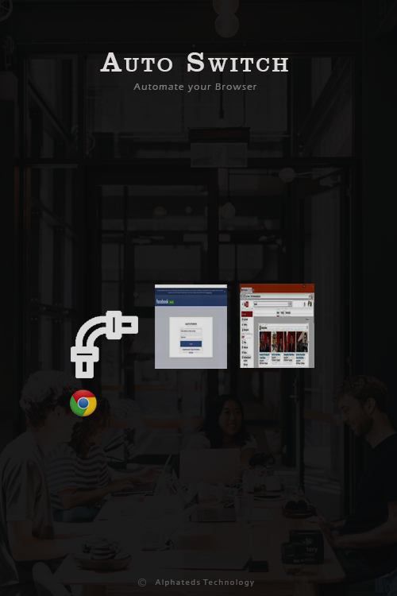

## Auto Switch Chrome Extension
"Desired Tabs Everytime Chrome Starts "Chrome Extension
You are different so you like to do smart things. When you are annoyed with irrelevant webpage as default page while opening the chrome, what you do?  For normal people they will click on new tab and type the website name, but since you are smart, you simply download this chrome extension, where you know you can add your desired websites or webpage as default webpage while opening chrome. With this installed you just sit back and relax. You also know, you can add as many pages as you want so you don't have to type all those websites everytime you restart your laptop. It's just a click away.
## Demo Video
Click : https://www.youtube.com/watch?v=3HpkBt55ggk